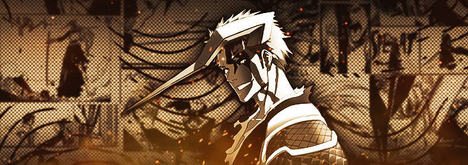
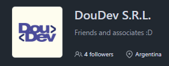

# Luciano Cayssials Fambrini

### Full Stack Developer

Programmer Analyst Student / Analista Programador en formación · La Pampa, Argentina

---

## About Me

I'm a **Full Stack Developer in training** and **Programmer Analyst student at UNLPam**, based in La Pampa, Argentina.

I build personal, academic and team projects focused on solving real problems through software, with an interest in **system design, backend/frontend development, performance, UI/UX and emerging technologies**.

My studies combine software engineering fundamentals with experimentation, allowing me to move between web applications, APIs, databases, mobile development and game programming.

### Current Focus

- Full Stack Web Development
- Backend architecture and API development
- Database design and optimization
- Android development for mobiles
- Software architecture and clean code
- AI-assisted development workflows
- Game programming
- System infrastructure

📍 **La Pampa, Argentina**

---

## Portfolio

### shackmerferu.dev.ar

My portfolio contains my professional profile, projects, technologies and contact information.

---

## Organizations

### DouDev SRL

**Co-Founder · Contributor · Developer**

DouDev is a software development initiative focused on building digital solutions and software products.

---

## Featured Projects

### SalePoint

**POS System for small business with future integration of payment gateway.**

SalePoint is a SaaS-based business management platform developed by DouDev, designed for small and medium-sized businesses.

**Status:** Finished/Updating

---

### DigitalArs Wallet

Full Stack digital wallet application developed with a modern web architecture.

**Technologies:**

`React` · `.NET` · `C#` · `SQL Server` · `JWT`

---

### LOAM

Android application focused on natural-disaster alerts.

**Technologies:**

`Kotlin` · `Android` · `Firebase`

---

## Tech Stack

### Languages

### Frontend

### Backend

### Databases

### Tools & Platforms

---

## Engineering Practices

- Object-Oriented Programming
- SOLID principles
- MVC
- REST API design
- Relational database design
- Agile methodologies
- Git-based development
- Clean code
- Software architecture

---

## AI & LLM & Automation Tools

- ChatGPT
- Opencode
- Gemini
- n8n

I use LLMs primarily as development tools for **research, prototyping, debugging, documentation and workflow automation**.

---

## Interests

- Web development
- Game programming
- Local-first applications
- Backend optimization
- UI/UX design
- AI integration
- Creative coding
- Open-source software
- System design

---

## Beyond Code

My interests outside software development include:

- Videogames
- Rock/blues/indie music
- Animation
- Problem solving
- Vocal music
- Martial arts

### Persona Alias

**Shackmerferu / Nefuric**

Autonomous · Analytical · Experimental

My working approach is based on:

**Deep focus → Iterative development → System-level thinking**

---

### Explore my work

